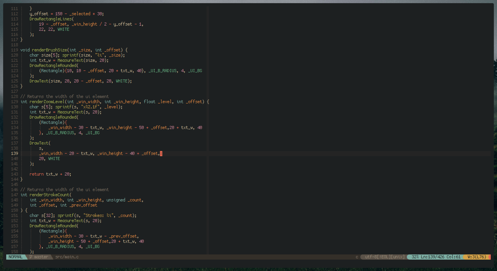
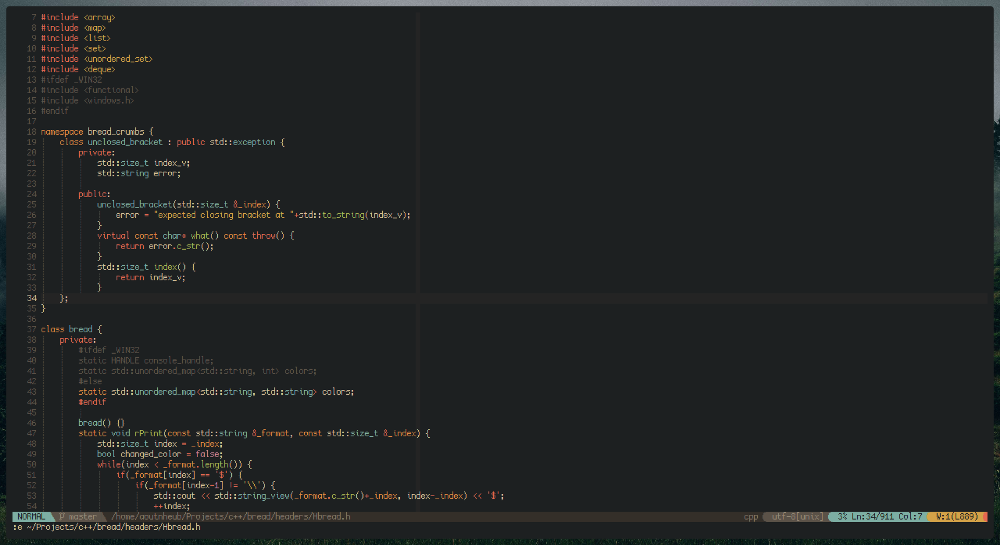

A recreation of the [Nightfall](https://www.reddit.com/r/unixporn/comments/n9alr9/awesome_working_on_rosequartz_compositor_birthday/) colorscheme by [u/HeavyRain266](https://www.reddit.com/user/HeavyRain266/)

# Screenshots

|||
|---|---|

# Install

**VimPlug**

Put this in your vimrc

`Plug 'Aoutnheub/nightfall.vim'`

**Manual**

Copy the `colors` and `autoload` folders to your Vim home directory

# Other

- **Font**: [Cozette](https://github.com/slavfox/Cozette)
